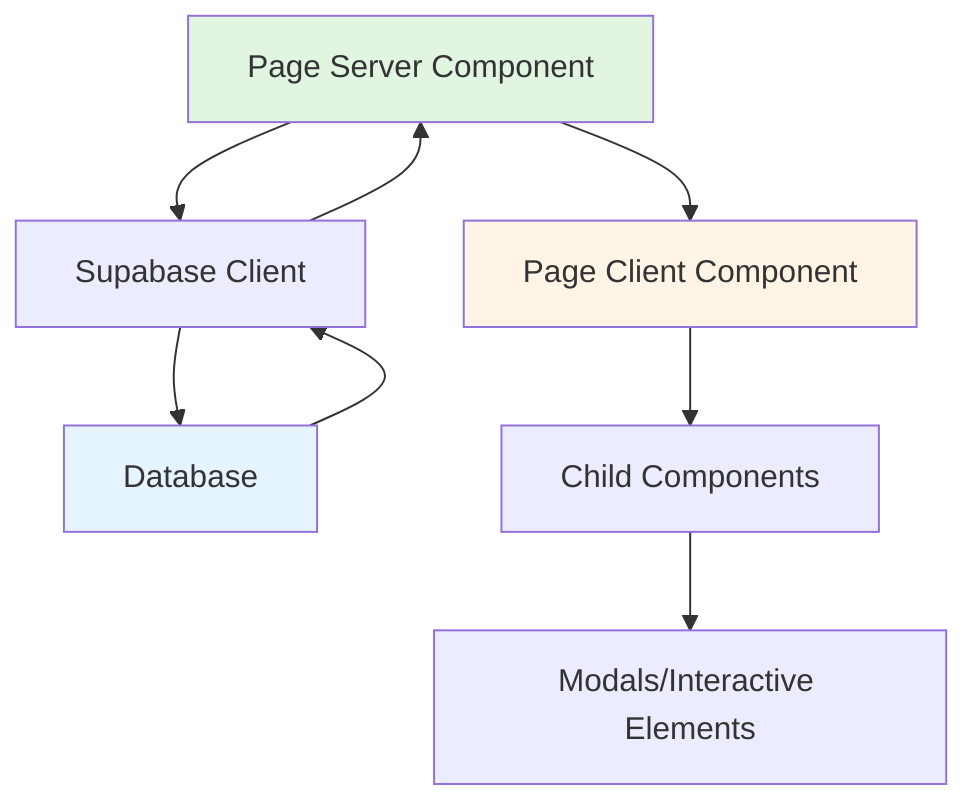

# Design Document

## Overview

This design implements a comprehensive Supabase integration across all pages and components of the SV Viktoria Wertheim website. The architecture follows Next.js 15 App Router patterns with Server Components for data fetching and Client Components for interactivity. The design ensures type safety through generated TypeScript types and maintains consistency with the existing HomePage implementation pattern.

## Steering Document Alignment

### Technical Standards (tech.md)
The design follows Next.js best practices:
- Server Components for initial data fetching
- Client Components only where interactivity is required
- TypeScript strict mode for type safety
- Supabase client utilities in /lib/supabase/

### Project Structure (structure.md)
Implementation follows the established project organization:
- Page components in /app/[page]/page.tsx
- Shared components in /components/
- Database utilities in /lib/supabase/
- Type definitions from /lib/database.types

## Code Reuse Analysis

### Existing Components to Leverage
- **createClient (lib/supabase/server)**: Server-side Supabase client for all data fetching
- **Database types (lib/database.types)**: Existing TypeScript types for all tables
- **HomePage pattern**: Proven Server/Client Component split pattern
- **AnimatedSection**: Existing animation wrapper for consistent UI
- **PageLayout**: Standard page wrapper with header/footer

### Integration Points
- **Supabase Database**: Direct connection using existing client setup
- **Row Level Security**: All queries respect existing RLS policies
- **Type System**: Full TypeScript integration with generated types
- **Existing Modals**: NewsModal, LeagueTableModal already accept typed props

## Architecture

The architecture follows a consistent Server Component → Client Component data flow pattern, matching the successful HomePage implementation.

### Important: Docker Container Setup
**Supabase runs in Docker containers NOT managed by Supabase CLI**
- Database only accessible within Docker network
- Port-forward required for type generation
- Migrations applied via `docker exec`
- See `/home/headon/Documents/supabase-docker-types-generation.md` for details

### Modular Design Principles
- **Single File Responsibility**: Each page handles only its own data fetching
- **Component Isolation**: Separate Server Components for data, Client Components for UI
- **Service Layer Separation**: Supabase queries isolated in Server Components
- **Utility Modularity**: Reusable query functions in /lib/supabase/queries/



## Components and Interfaces

### NewsPage Server Component
- **Purpose:** Fetch all news articles from Supabase
- **Interfaces:** Async function returning NewsPageClient with data props
- **Dependencies:** createClient, Database types
- **Reuses:** PageLayout, existing NewsModal component

### NewsPageClient Component
- **Purpose:** Handle news filtering, search, and display
- **Interfaces:** Props: { news: News[] }
- **Dependencies:** NewsModal for article display
- **Reuses:** AnimatedSection, existing filter logic

### TeamsPage Server Component
- **Purpose:** Fetch teams, players, and match data
- **Interfaces:** Async function returning TeamsPageClient with data
- **Dependencies:** createClient, multiple Supabase queries
- **Reuses:** PageLayout wrapper

### TeamsPageClient Component
- **Purpose:** Team selection and roster display
- **Interfaces:** Props: { teams: Team[], players: Player[], matches: Match[] }
- **Dependencies:** Team selection state management
- **Reuses:** AnimatedSection, existing UI components

### ContactPage Server Component
- **Purpose:** Fetch contact persons and social media links
- **Interfaces:** Async function returning ContactPageClient
- **Dependencies:** createClient, contacts table
- **Reuses:** PageLayout, existing form component

### LeagueTableServer Component
- **Purpose:** Fetch league standings for modal
- **Interfaces:** Props: { teamId: string }, returns standings data
- **Dependencies:** league_standings table
- **Reuses:** Existing modal UI

### TeamStatusServer Component  
- **Purpose:** Fetch team statistics for homepage display
- **Interfaces:** Props: { teamId: string }, returns stats
- **Dependencies:** teams and league_standings tables
- **Reuses:** Existing TeamStatus UI

## Data Models

### News Model (existing)
```typescript
type News = Database['public']['Tables']['news']['Row']
- id: string
- title: string
- excerpt: string | null
- content: string | null
- image_url: string | null
- published_at: string
- category: enum
- views: number
```

### Team Model (existing)
```typescript
type Team = Database['public']['Tables']['teams']['Row']
- id: string
- name: string
- team_type: '1' | '2' | '3' | 'youth'
- league: string
- coach: string | null
- captain: string | null
```

### Contact Model (implemented)
```typescript
type Contact = Database['public']['Tables']['contacts']['Row']
- id: string
- role: string
- name: string
- email: string | null
- phone: string | null
- order_position: number  // WICHTIG: Heißt order_position, nicht order!
- department: string | null
- is_active: boolean | null
- created_at: string | null
- updated_at: string | null
```

### Player Model (existing)
```typescript
type Player = Database['public']['Tables']['players']['Row']
- id: string
- team_id: string
- name: string
- number: number
- position: string
- is_captain: boolean
```

## Error Handling

### Error Scenarios

1. **Database Connection Failure**
   - **Handling:** Return empty arrays with console error logging
   - **User Impact:** Empty state message "Keine Daten verfügbar"

2. **Partial Data Load Failure**
   - **Handling:** Load available data, skip failed queries
   - **User Impact:** Page shows available content, missing sections show loading state

3. **Invalid Team Selection**
   - **Handling:** Default to first team, validate selection
   - **User Impact:** Automatic fallback to valid team

4. **News Article Not Found**
   - **Handling:** Modal shows error message
   - **User Impact:** "Artikel nicht gefunden" message

5. **Network Timeout**
   - **Handling:** Implement 10-second timeout on queries
   - **User Impact:** "Verbindung fehlgeschlagen" with retry button

## Testing Strategy

### Unit Testing
- Test individual query functions in isolation
- Mock Supabase client responses
- Verify error handling paths
- Test data transformation logic

### Integration Testing
- Test Server Component data fetching
- Verify props passing to Client Components
- Test filter and search functionality
- Validate modal data display

### End-to-End Testing
- User navigates to News page and reads article
- Team selection changes displayed data
- Contact form submission flow
- League table modal interaction
- Verify German content displays correctly