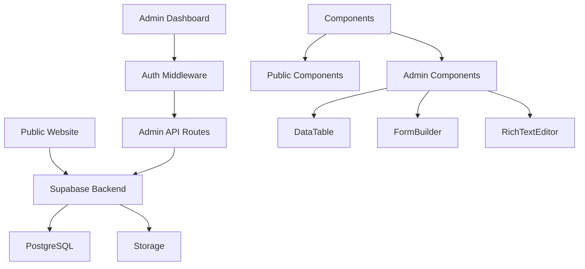

# Design Document

## Overview

The website completion involves two main architectural components: fixing the existing data integration layer to connect the frontend with the Supabase backend, and building a new admin dashboard for content management. The design leverages the existing Next.js 15 App Router architecture, Supabase infrastructure, and established component patterns while adding authentication and admin-specific routes.

## Steering Document Alignment

### Technical Standards (tech.md)
- **Next.js App Router**: Admin routes under `/app/admin/` following existing patterns
- **TypeScript**: Strict typing with generated Supabase types
- **Tailwind CSS**: Consistent styling using existing theme variables
- **Supabase SDK**: Using existing client/server utilities for data access

### Project Structure (structure.md)
- **Components**: Admin components in `/components/admin/`
- **Lib**: Shared utilities remain in `/lib/`
- **Database Types**: Continue using generated types from `database.types.ts`
- **API Routes**: New admin API routes under `/app/api/admin/`

## Code Reuse Analysis

### Existing Components to Leverage
- **PageLayout**: Base layout wrapper for admin pages
- **AnimatedSection**: Animation wrapper for admin dashboard sections
- **DarkModeToggle**: Theme switching in admin interface
- **LoadingSkeleton**: Loading states for admin data tables
- **Modal Components**: Reuse modal patterns for admin dialogs

### Integration Points
- **Supabase Client**: Extend existing `/lib/supabase/` utilities
- **Database Types**: Use existing `database.types.ts` for type safety
- **Tailwind Theme**: Apply existing color scheme to admin UI
- **Authentication**: Build on Supabase Auth with middleware protection

## Architecture

### Modular Design Principles
- **Single File Responsibility**: Each admin page handles one entity (news, matches, teams)
- **Component Isolation**: Reusable DataTable, FormField, RichTextEditor components
- **Service Layer Separation**: Admin API routes handle business logic
- **Utility Modularity**: Separate auth, validation, and upload utilities



## Components and Interfaces

### AdminLayout Component
- **Purpose:** Provides consistent admin interface with sidebar navigation
- **Interfaces:** `children: ReactNode`, `user: User`, `role: UserRole`
- **Dependencies:** Supabase Auth, Next.js navigation
- **Reuses:** DarkModeToggle, existing layout patterns

### DataTable Component
- **Purpose:** Reusable table for displaying and managing entities
- **Interfaces:** `columns: Column[]`, `data: T[]`, `onEdit: (item: T) => void`
- **Dependencies:** React hooks, Tailwind CSS
- **Reuses:** LoadingSkeleton for loading states

### FormBuilder Component
- **Purpose:** Dynamic form generation from schema definitions
- **Interfaces:** `schema: FormSchema`, `onSubmit: (data: any) => Promise<void>`
- **Dependencies:** react-hook-form, zod validation
- **Reuses:** Existing form patterns from contact/newsletter

### RichTextEditor Component
- **Purpose:** WYSIWYG editor for content creation
- **Interfaces:** `value: string`, `onChange: (value: string) => void`
- **Dependencies:** TipTap editor library
- **Reuses:** None (new component)

### ImageUploader Component
- **Purpose:** Drag-and-drop image upload to Supabase Storage
- **Interfaces:** `bucket: string`, `onUpload: (url: string) => void`
- **Dependencies:** Supabase Storage SDK
- **Reuses:** Existing storage patterns

## Data Models

### UserProfile (extends auth.users)
```typescript
interface UserProfile {
  id: string // UUID from auth.users
  email: string
  role: 'admin' | 'editor' | 'manager'
  full_name: string
  avatar_url?: string
  created_at: string
  last_login?: string
  permissions: string[] // specific permissions
}
```

### AdminAuditLog
```typescript
interface AdminAuditLog {
  id: string // UUID
  user_id: string // References UserProfile
  action: 'create' | 'update' | 'delete'
  entity_type: string // 'news', 'match', etc.
  entity_id: string
  changes?: Json // Before/after values
  timestamp: string
  ip_address?: string
}
```

### DraftContent
```typescript
interface DraftContent {
  id: string // UUID
  entity_type: 'news' | 'match_report'
  entity_id?: string // null for new content
  content: Json // Draft data
  author_id: string
  created_at: string
  updated_at: string
}
```

## Error Handling

### Error Scenarios

1. **Authentication Failure**
   - **Handling:** Redirect to login with return URL
   - **User Impact:** "Session expired. Please log in again."

2. **Insufficient Permissions**
   - **Handling:** Show 403 page with explanation
   - **User Impact:** "You don't have permission to access this feature."

3. **Database Connection Error**
   - **Handling:** Retry with exponential backoff
   - **User Impact:** "Connection issue. Retrying..." with fallback to error page

4. **File Upload Failure**
   - **Handling:** Client-side validation, size limits, type checking
   - **User Impact:** Clear error message with specific issue

5. **Validation Error**
   - **Handling:** Field-level error display
   - **User Impact:** Inline error messages next to affected fields

## Testing Strategy

### Unit Testing
- **Approach:** Jest + React Testing Library
- **Key Components:** FormBuilder validation, DataTable sorting/filtering
- **Coverage Target:** 80% for admin components

### Integration Testing
- **Approach:** Test admin API routes with mock Supabase client
- **Key Flows:** CRUD operations, authentication middleware
- **Database:** Use test database with seed data

### End-to-End Testing
- **Approach:** Playwright for critical admin workflows
- **User Scenarios:** 
  - Complete news article creation flow
  - Match result entry and table update
  - Role-based access verification
- **Environment:** Staging database with test accounts